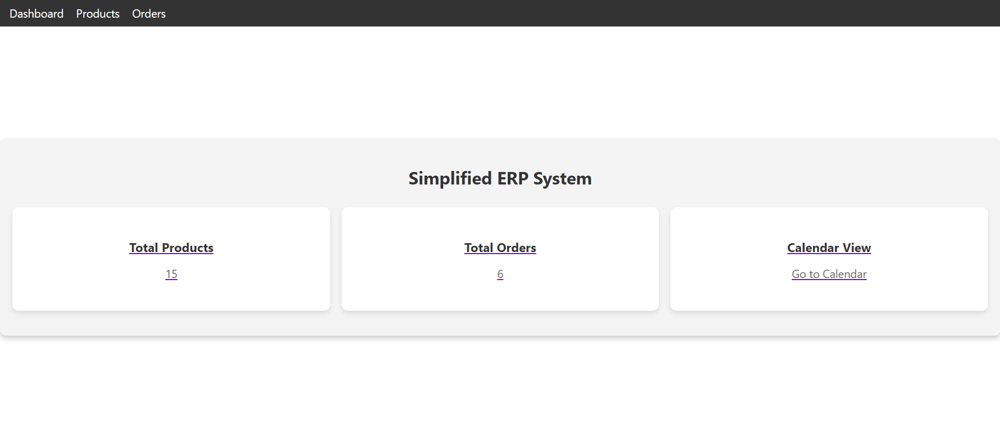
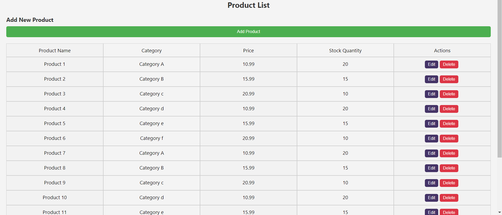
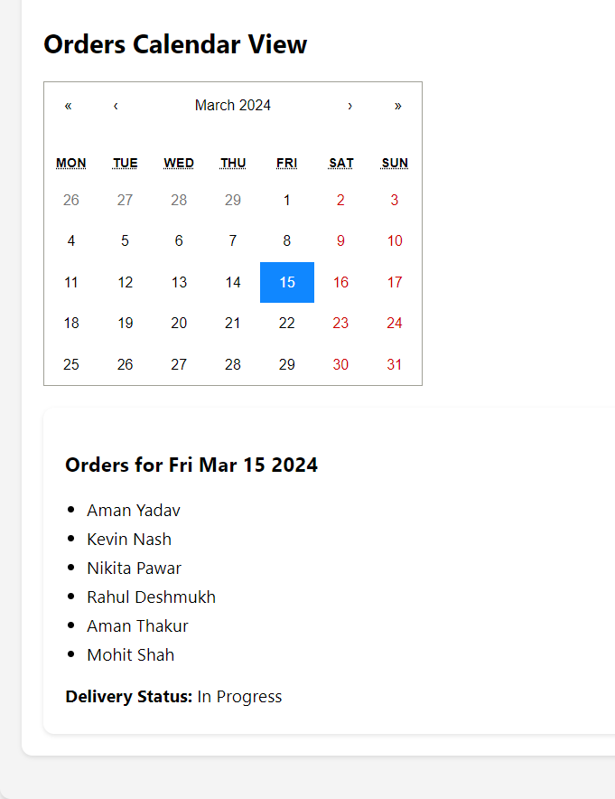

# Simplified ERP System with React Documentation

This ERP system is made using react. It contains the dashboard, products and order section. You can navigate it by clicking on it.

## Interaction with the Website & Usage of the Web Application

### Navigation tab

You can navigate throught the navigation bar.

### Dashboard

This is the Dashboard. It shows informations regarding products and orders.

### Products

This is the product page. Here you can add, view, edit or delete the product.

#### Adding a product

Once you entered the details then by clicking on add product product will be added

### Editing a product

If you click on "edit" and once you edit the information you can click on "save".

### Order page

On the order page you can see orders. Also you can see the details by clicking on "view details".

### Order details

You can see the details by clicking on "view details".

### Order Status

Order status can be updated to "devivered" by clickking on "ship" 

### Calender

 

By clicking on a particular calender date, you can see the details of orders.
